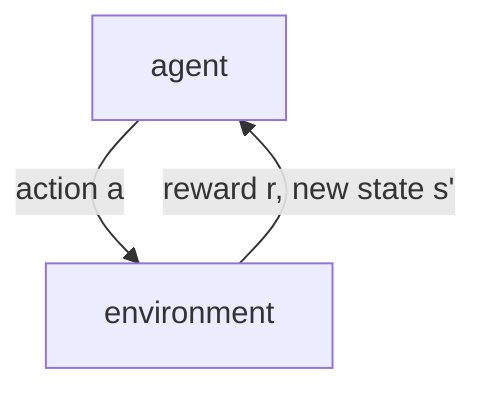

*Note: This was from stanford cs221 and is not part of cs234. I used this to gain some prerequistie knowledge for cs234*

**Resources:**
- [Lecture Video](https://youtu.be/HpaHTfY52RQ?feature=shared)

### Vocabulary
- Episode: A sequence of states and actions until you hit the end state
> You can look at the utility (discounted sum of rewards) of an episode
- On-Policy: Estimate the value of data-generating policy 
- Off-Policy: Estimate the value of another policy

### Markov Decision Processes and Reinforcement Learning

***At its core: reinforcement learning are MDPs without transition probabilities and rewards***

<u><b>Markov Decision Processes:<b/><u/>
- Have a mental model of how the world works
- You find the policy to maximize rewards

<u><b>Reinforcement Learning:<b/><u/>
- Don't know how the world works (we have no MDP for the situation)
- You perform actions in the world to figure out the reward function

**Reinforcement Learning Base Algorithm:**
- Choose an action $a_t = \pi _{act}(s _{t-1})$
- Receive a reward $r_t$ and observe new state $s_t$
- Update parameters

### Model-Based Monte Carlo Methods
**Core Idea:** estimate the MDP: $T(s, a, s')$ and reward $R(s, a, s')$

**Transition Formula:**

$$\hat{T}(s, a, s') = \frac{\text{# of times (s,a,s') occurs}}{\text{# of times (s,a) occurs}}$$

**Reward Formula:**
$$\hat{R}(s, a, s') = \text{r in (s, a, r, s')}$$

Once we have an estimated MDP, we calculate the policy using value iteration.

**Exploration:** One issue that could arise is that if your policy is non-exhaustive, then it might miss a state. This state may have a large reward and failing to explore it results in a suboptimal policy, To do reinforcement learning, we need to explore the state space. **Solution:** Have your policy, $\pi$ explore explicitly.

### Model-Free Monte Carlo

**Core Idea:** All that matters for prediction is an estimate of $Q _{opt}(s,a)$ so try to estimate $Q _{opt}(s,a)$ directly.

We know that we can calculate utility as follows: $u = r_t + \gamma \cdot r_{t+1} + \gamma^2 \cdot r_{t+2} \dots$. We can estimate $Q _{\pi}(s,a)$ as follows:

$$\hat{Q} _{\pi}(s,a) = \text{average of } u_t \text{ where } s _{t-1} = s, a_t = a \text{ where s, a doesn't occur in the episode}$$
Essentially get the average utility across many episodes where s,a occurs once

Model-Free is a on-policy approach because we are estimating the value of a specific policy

Convex Combination Equivalent Formulation for $\hat{Q} _{\pi}(s, a)$:

For each $s, a, u$

$$\eta = \frac{1}{1+\text{ updates to (s, a)}}$$
$$\hat{Q} _{\pi}(s, a) = (1 - \eta)\hat{Q} _{\pi}(s, a) + \eta u$$

Stochastic Gradient Descent Equivalent Formulation for $\hat{Q} _{\pi}(s, a)$:

$$\hat{Q} _{\pi}(s, a) = \hat{Q} _{\pi}(s, a) - \eta(\hat{Q} _{\pi}(s, a) - u)$$

$\hat{Q} _{\pi}(s, a) - u$ is the prediction minus the target $\rightarrow$ the implied objective is least sqaures regression which would be  $(\hat{Q} _{\pi}(s, a) - u)^2$

### SARSA

Algorithm: On each (s, a, r, s', a'):
$$\hat{Q} _{\pi}(s, a) = (1 - \eta)\hat{Q} _{\pi}(s, a) + \eta(r + \gamma\hat{Q} _{\pi}(s', a'))$$

where $r$ is the data and $\hat{Q} _{\pi}(s', a')$ is the estimate 

**Bootstrapping:** You use $\hat{Q} _{\pi}$ to estimate $\hat{Q} _{\pi}$ instead of $u$

Estimating using $u$:
- Based on one path
- Unbiased
- Large Variance
- Need to wait until end to update

Estimating using $r + \hat{Q} _{\pi}$:
- Based on estimate
- Biased
- Small Variance
- Can update immediately

*Model Free Monte Carlo and SARSA only estimate $Q _{\pi}$ not $Q _{opt}$. Use Q-learning to get $Q _{opt}$*

### Q Learning

**Q-Learning:** Calculates $\hat{Q} _{opt}$ using $\hat{Q} _{opt}$ and $r$. This is an off-policy technique.

For each $(s, a, r, s')$

$$\hat{Q} _{opt}(s, a) = (1 - \eta)\hat{Q} _{opt}(s, a) + \eta(r + \gamma\hat{V} _{opt}(s'))$$
$$\hat{V} _{opt}(s') = max _{a' \in Actions(s')} \hat{Q} _{opt}(s', a')$$

where $\hat{Q} _{opt}(s, a)$ is the prediction and $r + \gamma\hat{V} _{opt}(s')$ is the target.

### Exploration vs Exploitation

Extreme 1: No exploration, all exploitation - choose the action that leads to the highest $\hat{Q} _{opt}$ (too greedy) 

$$\pi _{act}(s) = argmax _{a \in Actions(s)} \hat{Q} _{opt}(s, a)$$

Extreme 2: No exploitation, all exploration - choose an action randomly. Leads to bad average utility because exploration is not guided

$$ \pi _{act}(s) = \text{random from Actions(s)}$$

### Epsilon Greedy Policy

Balances exploitation and exploration using a parameter, $\epsilon$:
- With probability $1 - \epsilon$, we choose exploitation
- With probability $\epsilon$, we choose exploration 

Problem: Large state spaces are hard to explore

Stochastic Gradient Descent Update:

$$\hat{Q} _{\pi}(s, a) = \hat{Q} _{\pi}(s, a) - \eta(\hat{Q} _{\pi}(s, a) - u)$$

**Rote Learning:** Every $\hat{Q} _{\pi}(s, a)$ has a different value (not really learning) $\rightarrow$ doesn't generalize to unseen states/actions

### Function Approximation

**Core Idea:** Instead of a lookup table, use a linear regression model with features $\phi(s, a)$ and weights $w$ to generalize to unseen states:
$$ \hat{Q} _{opt}(s, a; w) = w \cdot \phi(s, a)$$

**Q-Learning with Function Approximation:**

$$ w = w - \eta(\hat{Q} _{opt}(s, a; w) - (r + \gamma\hat{V} _{opt}(s')))\phi(s, a)$$

Where $\hat{Q} _{opt}(s, a; w) - (r + \gamma\hat{V} _{opt}(s'))$ is the prediction minus the target

### Miscellaneous
- Partial Feedback: You can only learn about actions you take
- State: Rewards depend on previous state   
- Reinforcement Learning: Partial Feedback + State
- Deep RL: Use neural networks to estimate $\hat{Q} _{opt}(s, a)$
- Policy Gradient: Use neural networks to train a policy directly