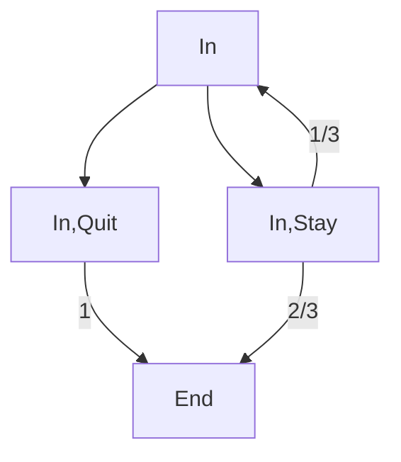

*Note: This was from stanford cs221 and is not part of cs234. I used this to gain some prerequistie knowledge for cs234*

**Resources:**
- [Lecture Video](https://youtu.be/9g32v7bK3Co?feature=shared)

### Introduction
Based on uncertainty / randomness of the real world where a state + action combo can lead to two different states.

**Applications:**
- Robotics (actuators can fail, unseen obstacles)
- Resource Allocation (do not know customer demand for various products)
- Agriculture (uncertain weather impacts crop yield)

### Markov Decision Processes

**Transition State Diagram:** 

Blocks represent the state nodes/ state-action node. Label edges represent the probability of that transition occuring from that state-action node.

**Transition Function:** Gives you the probability of going from a given state to another state given an action.
- $T(s, a, s') > 0$ where $s$ is a given state, $a$ is an action, and $s'$ is the next state
- Adding up all possible $s'$ you can end up at for the same $s, a$ should result in 1
    - $\sum_{s' \in \text{states}}T(s, a, s') = 1$

**Reward Function:** Gives you the reward of the transition from one state to another given an action
- $R(s, a, s')$ where $s$ is a given state, $a$ is an action, and $s'$ is the next state

**Markov:** Future states only depend on the current state and action taken.

**Policy ($\pi$):** A mapping from each state $s \in \text{states}$ to each action $a \in \text{Actions}(s)$
- This is the solution to an MDP

**Discount Factor:** The value of future rewards relative to your current day rewards 
- Range: $0 \leq \gamma \leq 1$
- 1 means save for the future
- 0 means live in the moment

### Policy Evaluation

**Utility:** The discounted sum of rewards over a random path that is yielded by a specific policy.
- Utility is a random variable
- Formula: $U = r_1 + \gamma r_2 + \gamma^2 r_3 + ....$

**Value:** The expected utility of a specific policy
- Average of utilities on all random paths
- Not a random variable

**Value of a Policy**: Expected utility received by following policy $\pi$ from state $s$ - denoted by $V_\pi(s)$

**Q-Value of a Policy**: Expected utility from a state-action node - denoted by $Q_\pi(s, a)$

Recurrence Using $V_\pi(s)$ and $Q_\pi(s, a)$:

$$
V_\pi(s) = 
    \begin{cases}
        \{
        0 \text{ if } \text{IsEnd}(s) = \text{True, }
            \text{else } Q_\pi(s, a)\}
    \end{cases}
$$
$$Q_\pi(s, a) = \sum_{s'}T(s, a, s')[R(s, a, s') + \gamma V_\pi(s')]$$

**Iterative Algorithm:** Start with arbitrary policy values and apply the recurrence until convergence

- Step 1. Initialize $V^0_\pi(s) = 0$ for all states $s$.
- Step 2. Iterate until convergence (keep track of a time, t)
- Step 3. For each state s update $V^t = \sum_{s'}T(s, \pi(s), s')[R(s, \pi(s), s') + \gamma V^{(t-1)}_\pi(s')]$
- Note:  $Q^{(t-1)}(s, \pi(s)) = V^t_\pi(s)$

**Implementation Details:** We want to wait until convergence but that might take a while so we use this heuristic:

$$\text{max}_{s \in \text{states}} V^t _\pi(s) - V^{t-1} _\pi(s) \leq \epsilon$$

- Only need to store last two iterations of $V^t_\pi(s)$, not all 

### Value Iteration

**Optimal Value:** The maximum value obtained by any policy - denoted by $V_{opt}(s)$

$$Q_{opt}(s, a) = \sum_{s'}T(s, a, s')[R(s, a, s') + \gamma V_{opt}(s')]$$
$$
V_{\text{opt}}(s) = 
\begin{cases}
0 \text{ if } \text{IsEnd}(s) = \text{True, }\\
\text{else } \max_{a \in \text{Actions}(s)} Q_\pi(s, a)
\end{cases}
$$
$$\pi_{opt}(s) = argmax_{a \in \text{Actions(s) }} \text{ }Q_{opt}(s,a)$$

**Iterative Algorithm:** 
- Step 1. Initialize $V^0_{opt}(s) = 0$ for all states $s$.
- Step 2. Iterate until convergence (keep track of a time, t)
- Step 3. For each state s update $V_{opt}^t = \text{max}_{a \in \text{Actions(s)}} (\sum _{s'}T(s, a, s')[R(s, a, s') + \gamma V^{(t-1)} _{opt}(s')])$
- Note:  $Q^{(t-1)}(s, a) = V^t_{opt}(s)$
