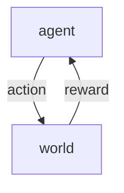

**Resources:**
- [Lecture Video](https://youtu.be/FgzM3zpZ55o?feature=shared)

### Introduction

**Goal:** Use data / experience to make the best sequence of good decisions under certainty
**Credit Assignment Problem:** The causal relationship between actions and future rewards

|                            | Optimization | Exploration | Generalization | Delayed Consequences |
|:----------------------------|:--------------|:-------------|:----------------|:----------------------|
| **Reinforcement Learning**     |✅|✅|✅|✅|
| **Planning**                   |✅||✅|✅|
|**Supervised Machine Learning** |✅||✅||
|**Unsupervised Machine Learning** |✅|||✅|
|**Imitation Learning** |✅||✅|✅|

### Imitation Learning
Learning to do something by observing another agent do that task. 

**Benefits:**
- Great tools for supervised learning
- Avoids exploration problem
- When there is lots of data, we have data over many outcomes

**Limitations:**
- Expensive to capture
- Limited by data collected

### Sequential Decision Making

**Goal:** Maximize total expected future reward 
- balance long-term and immediate rewards
- require strategic behavior to achieve high rewards

**History:** $h_t = (a_1, o_1, r_1...a_t, o_t, r_t)$
- $a$: the action
- $o$: the observation
- $r$: the reward
- $t$: the time (discrete time period)
- state, $s_t = (h_t)$, is a function of history 

**World State:** The true state of the world generates next state + reward. This is usually unknown to the agent

**Markov Assumption:** To predict the future, you only need to know the current state (future independent of past given the present)
$$p(s _{t+1}| s_t, a_t) = p(s _{t+1}| h_t, a_t) $$
  
Setting the state as the history will always make the problem markov (but that is a lot information $\rightarrow$ using most recent observation for state is generally enough)

### Observability

- **Fully Observable World:** Agent state and world state are the same $\rightarrow s_t = o_t$
- **Partially Observable World:** Agent state and the world state are not the same $\rightarrow$ agent constructs its own state. Uses history, beliefs about the world, etc. to construct its own state. Examples: Poker (you only see your own cards), Healthcare (don't see all physiological processes)

### Types of Sequential Decision Processes
- **Bandits:** Actions have no influence on next observations and no delayed rewards
- **MDPs and POMDPs:** Actions influence observations
- **Deterministic:** Given a history and action, there is a single observation and reward
- **Stochastic:** Given a history and action, there are many potential observations and rewards

### RL Algorithm Components
- **Model:** Representation of how the world changes in response to an agent's action
  - Transition: $p(s _{t+1} = s' \vert s _t, a _t)$
  - Reward: $r(s_t = s, a_t = a) = E[r_t \vert s_t = s, a_t = a]$
- **Policy:** Function mapping of agent's states to action
  - Deterministic: One action per state
  - Stochastic: Distribution of actions per state
- **Value Function:** Future rewards from being in a state and/or action when following a policy
  - Expected discounted sum of rewards
  - Formula: $V^\pi(s_t = s) = E _{\pi}[r_t + \gamma r _{t+1}+ \gamma^2 r _{t+2} + \dots \vert s_t = s]$
  - Discount Factor: weighs immediate vs future rewards
  - Quantify the goodness or badness of states and actions

### Types of RL Agents
- **Model Based:** Explicit model $\rightarrow$ may or may not have a policy and/or value function
- **Model Free:** No explicit model $\rightarrow$ explicit policy and/or value function

### Challenges in RL
- Agent doesn't know how the world works
- Agent needs to know how to interact with the world to make good decisions
- Agent needs to figure out how to improve policy

### Exploration and Exploitation
- Exploration: Trying new things to enable the agent to make better decisions in the future
- Exploitation: Choosing actions that are expected to yield good rewards given past experience

### Evaluation and Control
- Evaluation: Given a policy, estimate the reward
- Control: Find the best policy