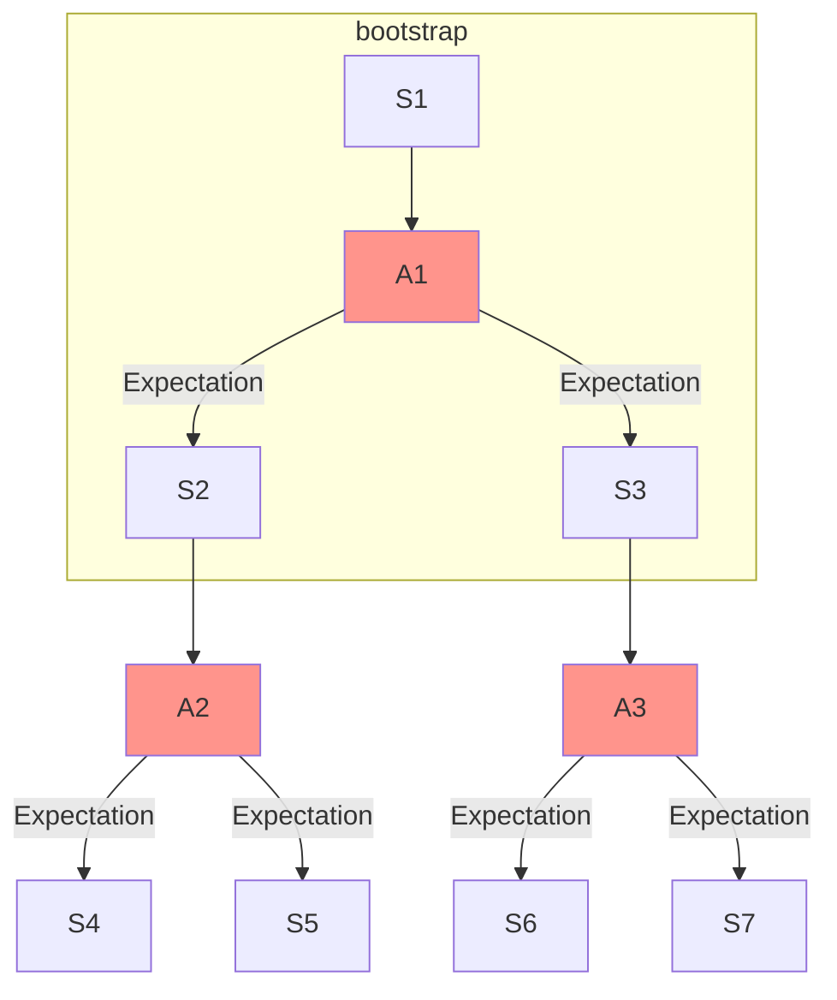

**Resources:**
- [Lecture Video](https://youtu.be/dRIhrn8cc9w?feature=shared)

### Dynamic Programming Policy Evaluation

- **Bootstrapping:** Dynamic programming computes the highlighted area by bootstrapping the rest of the expected return with value estimate of $V _{k-1}$
  - Update for $V$ uses an estimate as opposed to an exact value

### Monte Carlo Policy Evaluation
- Does not require an MDP dynamics or rewards
- No Bootstrapping
- Does not assume state is markov
- Can only be applied to episodic MDPs
  - Requires each episode to terminate
  - Averaging returns over a complete episode
- Value Function: $V^{\pi}(s) = E _{T \tilde{\pi}}[G_t \vert s_t = s]$
  - Get the value over all possible trajectories and average them
- Done in an incremental fashion
  - After each episode, $V^{\pi}(s)$ gets updated
- **First-Visit Monte Carlo On Policy Evaluation Algorithm**
  - Initialize $N(s) = 0, G(s) = 0, \forall s \in S$ $\rightarrow N(s)$ is the number of times a state has been visited
  - Loop
    - Take a sample episode $i = s _{i,1}, a _{i, 1}, r _{i, 1}, s _{i,2}, a _{i, 2}, r _{i, 2}, \dots s _{i,T}$
    - Define $G _{i, t} = r _{i, t} + \gamma r _{i, t+1} + \dots$ as return from time step t onwards for the ith episode
    - For each state, $s$,  visited in episode i
      - For the first time $t$ that state $s$ is visited in that episode
        - Increment $N(s)$: $N(s) = N(s) + 1$
        - Increment total return: $G(s) = G(s) + G _{i, t}$
        - Update Estimate $V^{\pi}(s) = G(s) / N(s)$
- **Every-Visit Monte Carlo On Policy Evaluation Algorithm**
  - Initialize $N(s) = 0, G(s) = 0, \forall s \in S$ $\rightarrow N(s)$ is the number of times a state has been visited
  - Loop
    - Take a sample episode $i = s _{i,1}, a _{i, 1}, r _{i, 1}, s _{i,2}, a _{i, 2}, r _{i, 2}, \dots s _{i,T}$
    - Define $G _{i, t} = r _{i, t} + \gamma r _{i, t+1} + \dots$ as return from time step t onwards for the ith episode
    - For each state, $s$,  visited in episode i
      - For the **every** time $t$ that state $s$ is visited in that episode
        - Increment $N(s)$: $N(s) = N(s) + 1$
        - Increment total return: $G(s) = G(s) + G _{i, t}$
        - Update Estimate $V^{\pi}(s) = G(s) / N(s)$
- **Incremental Monte Carlo On Policy Evaluation Algorithm**
  - After each episode $i = s _{i,1}, a _{i, 1}, r _{i, 1}, s _{i,2}, a _{i, 2}, r _{i, 2}, \dots s _{i,T}$
    - Define $G _{i, t} = r _{i, t} + \gamma r _{i, t+1} + \dots$ as return from time step t onwards for the ith episode
    - For each state, $s$,  visited in episode i
        - Increment $N(s)$: $N(s) = N(s) + 1$
        - Update Estimate: $V^{\pi}(s) = V^{\pi}(s) \frac{N(s) -1}{N(s)}+ \frac{G _{i,t}}{N(s)} = V^{\pi}(s) + \frac{1}{N(s)}(G _{i,t} - V^{\pi}(s))$
  - We can rewrite the running mean (estimate) as follows: $V^{\pi}(s) + \alpha(G _{i,t} - V^{\pi}(s))$
    - If $\alpha = \frac{1}{N(s)}$: This is identical to every visit monte carlo
    - If $\alpha > \frac{1}{N(s)}$: Forget older data (good for non-stationary domains)
- Limitations
  - High Variance estimator
  - Requires episodic settings $\rightarrow$ episode must end before we can use it to update the value function

### Bias, Variance, and MSE
- **Bias:** Expected Value - True Value
  - $Bias _{\theta}(\hat{\theta}) = E _{x\vert\theta}[\hat{\theta}]  - \theta$
- **Variance:** $Var(\hat{\theta}) = E _{x\vert\theta}[(\hat{\theta} - E[\hat{\theta}])^2]$
- **Mean Squared Error:** $MSE(\hat{\theta}) = Var(\hat{\theta})^2 + Bias(\hat{\theta})^2$

**Back to First Visit Monte Carlo:**
- $V^{\pi}$ is an unbiased estimator of the true $E _{\pi}[G_t \vert s_t = s]$
  - **Consistent:** By law of large numbers, as $N(s) \rightarrow \infty$, $V^{\pi}$ converges to $E _{\pi}[G_t \vert s_t = s]$

**Back to Every Visit Monte Carlo:**
- $V^{\pi}$ is a biased estimator of the true $E _{\pi}[G_t \vert s_t = s]$
  - Better MSE and still consistent

### Temporal Difference Learning
- Model free approach that combines monte carlo and dynamic programming methods for policy evaluation $\rightarrow$ both bootstraps and samples
  - Can be used for episodic and infinite horizon settings
  - Can immediately update estimates of $V$
- Similar to incremental every visit monte carlo but instead of having to wait until the end of an episode to get $G_t$, we can estimate $V^\pi$ using our old estimate of our next state $\rightarrow r_t + \gamma V^\pi (s _{t+1})$ (bootstrapping)
  - $V^\pi(s_t) = V^\pi(s_t) + \alpha([r_t + \gamma V^\pi(s _{t+1})] - V^\pi(s_t))$
  - TD Error: $\delta _t = r_t + \gamma V^\pi(s _{t+1}) - V^\pi(s_t)$
    - TD Target: $r_t + \gamma V^\pi(s _{t+1})$
- **Temporal Difference (0) Learning Algorithm**
  - Initialize $V^{\pi}(s) = 0 \forall s \in S$
  - Loop
    - Sample $(s_t, a_t, r_t, s _{t+1})$
    - Compute $V^\pi(s_t) = V^\pi(s_t) + \alpha([r_t + \gamma V^\pi(s _{t+1})] - V^\pi(s_t))$

### Dynamic Programming vs Monte Carlo vs Temporal Difference

|                                          | Dynamic Programming | Monte Carlo     | Temporal Difference |
| :--------------------------------------- | :------------------ | :-------------- | :------------------ |
| **Usable without a model of the domain** | ✅                   | ✅               | ✅                   |
| **Usable with non-episodic domains**     | ✅                   |                 | ✅                   |
| **Handles Non-Markovian domains**        |                     | ✅               |                     |
| **Converges to true value in limit**     | ✅                   | ✅               | ✅                   |
| **Unbiased estimate of value**           |                     | ✅ (first visit) |                     |

Properties to Evaluate Algorithms:
- Bias / Variance
  - Monte Carlo is unbiased + high variance + consistent
  - Temporal Difference (0) has some bias + lower variance + converges with tabular representation (not necessarily with function approximation)
- Data efficiency
- Computational efficiency

  ### Batch Monte Carlo and Temporal Difference
  - Batch / Offline Solution for finite dataset:
    - Given K episodes
    - Repeatedly sample an episode from K
    - Apply TD(0) or MC until convergence
  - Monte Carlo in batch setting minimizes MSE
    - Minimize loss with respect to expected returns
    - TD(0) converges DP policy $V^\pi$ for the MDP with the maximum likelihood model estimates
