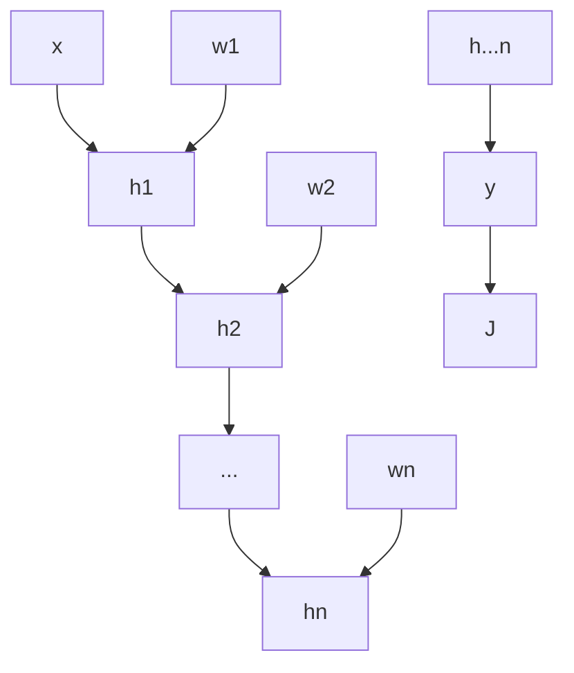

**Resources:**
- [Lecture Video](https://youtu.be/gOV8-bC1_KU?feature=shared)

### Limitations to Linear Value Function Approximation
- Assumes that the value function is a weighted combination of a set of features where each feature is a function of the state
- Requires carefully hand designing a feature set
  - Would be much better if you could go from states without needing a specific feature set
- Local representations (like kernel approaches) doesn't scale well to enormous state spaces and datasets

### Deep Neural Networks
- Composition of multiple functions
  

- $J$ is the loss function
- $y = h_n(h _{n-1} (\dots h_1(\overrightarrow{x})))$
- Backpropgates gradient using the chain rule
  - The h functions must be differentiable
    - Linear: $h_n = w*h _{n-1}$
    - Nonlinear: $h_n = f(h _{n-1})$ (activation functions like sigmoid or ReLU)
**Benefits:**
- Uses distributed representations instead of local ones
- Universal function approximator
- Potentially need exponential fewer nodes/parameters (compared to a shallow net) to represent the same function
- Can learn parameters using stochastic gradient descent

### Convolutional Neural Networks
- Fully Connected Network: Requires an enormous amount of data for visual data
  - High space-time complexity
  - Lack of structure + locality of info
- Convolutional Neural Networks
  - Considers the local structure + extraction of features
  - Not fully connected
  - Locality of processing
  - Weight sharing for parameter reduction
    - Local parameters that are idential for groups of pixels in the image
  - Learns the parameters of multiple convolutional filter banks
  - Compress to extract salient features and favors generalization
- Locality of Information
  - Receptive Field: An input patch of where the hidden unit is connected to
  - Stride: How much you move the patch
  - Zero Padding: How many 0s to add to either side of an input layer
  - Activation value of the hidden layer neuron: $g(b + \sum _i w_ix_i)$
- Feature Maps: 
  - All neurons in the first hidden layer capture the same feature just at different locations in hte feature map
  - Feature: A pattern that makes a neuron produce a certain response level
- Pooling Layers:
  - Used immediately after covolutional layers
  - Simplifies / compresses infomration in the output from a convolutional layer
  - Takes each feature map output from convolutional layer and prepares a condensed feature map
- Final Layer Fully Connected:
  - Prior to final layer we are creating some feature representation
  - Final layer is used to make a prediction

### Deep Q-Networks (DQN)
- Represent value function, policy, and model using DNNs

### DQNs in Atari
- End to end learning of values $Q(s, a)$ from pixels s
  - Input state $s$ is stack of raw pixels from last 4 frames
    - Allows you to grab velocity + position of the ball
  - Output is $Q(s, a)$ for 18 joystick/button presses
  - Reward is change in score for that step
  - Same network architecture and hyperparameters across all games
- Minimize MSE loss with stochastic gradient
- Divergence with Q-learning
  - Correlations between samples
  - Non-stationary targets
- Address divergence with
  - Experience Replay
  - Fixed Q Targets

### DQN: Experienced Replay
- To help remove correlations, store dataset (a reply buffer) from prior experience
- To perform experience replay, repeat the following
  - Sample an experience tuple from the dataset $(s, a, r, s')$
  - Compute the target value for the sampled $s: r + \gamma max _{a'}\hat{Q}(s', a'; w)$
  - Use stochastic gradient descent to update weights
    - $\Delta w = \alpha (r + \gamma max _{a'}\hat{Q}(s', a'; w) - \hat{Q} (s, a; w))\nabla_w \hat{Q}(s, a; w)$

### Fixed Q Targets
- To improve stability, fix the target weights used in the target calculation for multiple updates
  - Fix the w in $r + \gamma V(s'; w)$ for several rounds
    - Approximation of the oracle of the $V^\ast$
  - Use a different set weights to compute target than that is being updated
    - $w^-$: Set of weights used for target computation
      - Gets updated periodically (i.e., every $n$ steps $w^- = w$)
    - $w$: Set of weights being updated
  - Computation of target changes: $r + \gamma max _{a'}\hat{Q}(s', a'; w^-)$
    - SGD: $\Delta w = \alpha (r + \gamma max _{a'}\hat{Q}(s', a'; w^-) - \hat{Q} (s, a; w))\nabla_w \hat{Q}(s, a; w)$

### Double DQN
- Similar idea to Double Q Learning but we have one network to selection actions and one network to evaluate actions
  - $w$: Weights for network used to select actions
  - $w^-$: Weights for network used to evaluate actions
  - $\Delta w = \alpha (r + \gamma \hat{Q}(argmax _{a'} \hat{Q}(s', a'; w); w^-) - \hat{Q}(s, a; w))$
    - Action Selection: $argmax _{a'} \hat{Q}(s', a'; w)$
    - Action Evaluation: $\hat{Q}(argmax _{a'} \hat{Q}(s', a'; w); w^-)$
  - Swap the $w^-$ and $w$ on each timestep which ensures both sets of weights get updated frequently
  - Avoids maximization bias

### Prioritized Replay
- Prioritizing which replay you sample leads to exponential improvements in covergence (if we had a perfect oracle that could tell us the next replay to choose)
- Heuristic: Prioritize Tuples Based on DQN Error:
  - Let i be the index of the tuple of experience $(s_i, a_i, r_i, s _{i+1})$
  - Sample tuples using priority function
  - Priority of tuple is proportional to DQN error: $p_i = \vert r + \gamma max _{a'} Q(s _{i+1}, a'; w^-) - Q(s_i, a_i; w)\vert$
  - Update $p_i$ every update (initially set to 0)
  - Probability of selecting that tuple: $P(i) = \frac{p_i^\alpha}{\sum_k p_k^\alpha}$

### Dueling DQN
- Intuition: Features needed for value are not necessarily the features you need to determine the benefit of an action
- **Advantage Function:** $A^\pi(s, a) = Q^\pi(s,a) - V^\pi(s)$
- Dueling DQNs seperate the value function and advantage function and estimate them seperately and then recombine them for the Q function
- Not identifiable $\rightarrow$ given a $Q^\pi$ we cannot decompose it into a unique $A^\pi$ and $V^\pi$